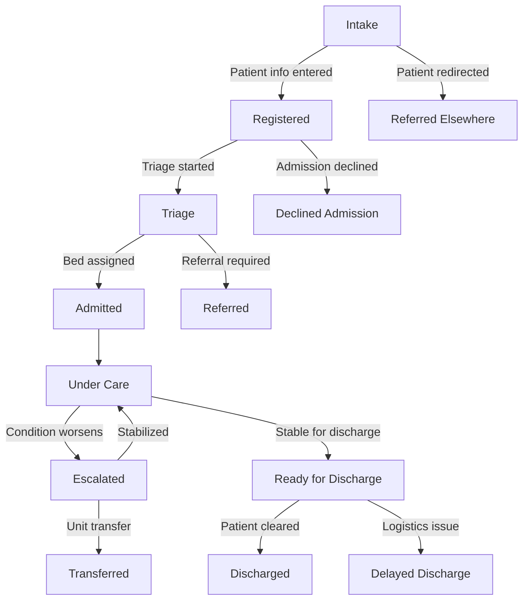

### 🔁 State Table

| **State**                 | **Triggered By**                                   | **Next Possible States**                    |
|--------------------------|----------------------------------------------------|---------------------------------------------|
| `Intake`                 | Patient arrives at facility                        | `Registered`, `Referred Elsewhere`          |
| `Registered`             | Admin enters patient info                          | `Triage`, `Declined Admission`              |
| `Triage`                 | Nurse or clinician assesses condition              | `Admitted`, `Referred`                      |
| `Admitted`               | Bed is assigned and care team initiated            | `Under Care`                                |
| `Under Care`             | Routine monitoring and treatment ongoing           | `Escalated`, `Ready for Discharge`          |
| `Escalated`              | Deteriorating condition, transferred to another unit| `Under Care`, `Transferred`                |
| `Ready for Discharge`    | Clinician initiates discharge planning             | `Discharged`, `Delayed Discharge`           |
| `Discharged`             | All clearance complete, patient leaves             | End state                                   |

### Patient Flow Diagram (from Intake to Discharge)

