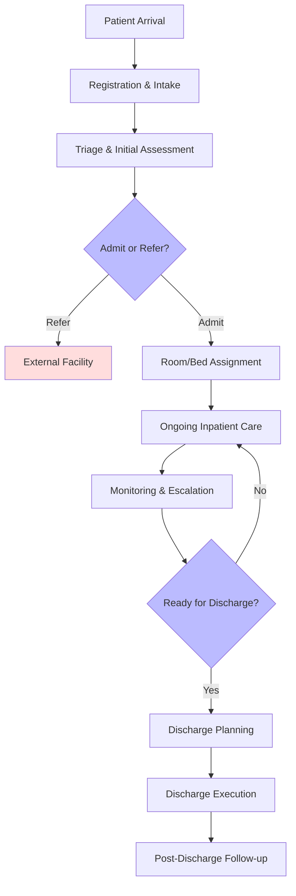

# 3. Patient States and Intake Flow

### 🔁 Patient States

| **State**                 | **Triggered By**                                   | **Next Possible States**                    |
|--------------------------|----------------------------------------------------|---------------------------------------------|
| `Intake`                 | Patient arrives at facility                        | `Registered`, `Referred Elsewhere`          |
| `Registered`             | Admin enters patient info                          | `Triage`, `Declined Admission`              |
| `Triage`                 | Nurse or clinician assesses condition              | `Admitted`, `Referred`                      |
| `Admitted`               | Bed is assigned and care team initiated            | `Under Care`                                |
| `Under Care`             | Routine monitoring and treatment ongoing           | `Escalated`, `Ready for Discharge`          |
| `Escalated`              | Deteriorating condition, transferred to another unit| `Under Care`, `Transferred`                |
| `Ready for Discharge`    | Clinician initiates discharge planning             | `Discharged`, `Delayed Discharge`           |
| `Discharged`             | All clearance complete, patient leaves             | End state                                   |

### Patient Flow Diagram (from Intake to Discharge)

### Patient Flow Explained

#### 🔹 1. **Pre-Arrival / Walk-In**
- Patient arrives via walk-in, referral, or ambulance
- Optional: Basic pre-registration via community clinic or mobile application
- Trigger: `New Intake` flow starts

#### 🔹 2. **Intake & Registration**
- Admin staff or nurse captures:
  - Demographics
  - ID and insurance info
  - Chief complaint / referral note
- Patient ID is generated (QR)
- Bed availability check initiated
- **System triggers triage task**

#### 🔹 3. **Triage & Initial Assessment**
- Vital signs, pain assessment, condition urgency level
- Staff assigns patient to “Urgency Category” (e.g. red/yellow/green)
- Initial orders may be created if urgent (e.g. oxygen, IV fluids)
- Clinician or nurse confirms admission decision
- **Triggers bed assignment + task cascade**

#### 🔹 4. **Admission & Room Assignment**
- Patient assigned to ward/room/bed
- Admission order logged by clinician
- Initial care team assigned (nurse, attending physician)
- Patient orientation protocol triggered

#### 🔹 5. **Ongoing Inpatient Care**
Core of the stay—loops daily through:
- Vital signs tracking
- Medication administration
- Diagnostic testing (labs, imaging)
- Doctor rounds + notes
- Multidisciplinary care updates
- Allied services: physio, dietary, counseling (if available)
- **Daily checklist tasks created per patient condition** (AI maybe?)

#### 🔹 6. **Monitoring & Escalation**
- System monitors vitals / inputs for red flags
- Auto-escalate abnormal values or missed meds
- “Early Warning Score” or triage watchlist flags high-risk patients

#### 🔹 7. **Discharge Preparation**
- Clinician initiates discharge planning:
  - Medication summary
  - Follow-up plan
  - Home care referrals or transport
- Billing + admin notified to prepare documents
- Bed marked "pending discharge"

#### 🔹 8. **Discharge & Handover**
- Discharge instructions given to patient/family
- Meds provided (or prescription)
- Transport arranged (if needed)
- Patient is checked out, bed marked “cleaning required”
- Post-discharge call/reminder set (optional)

---

Next: [4. Roles and Access](roles_and_access.md)